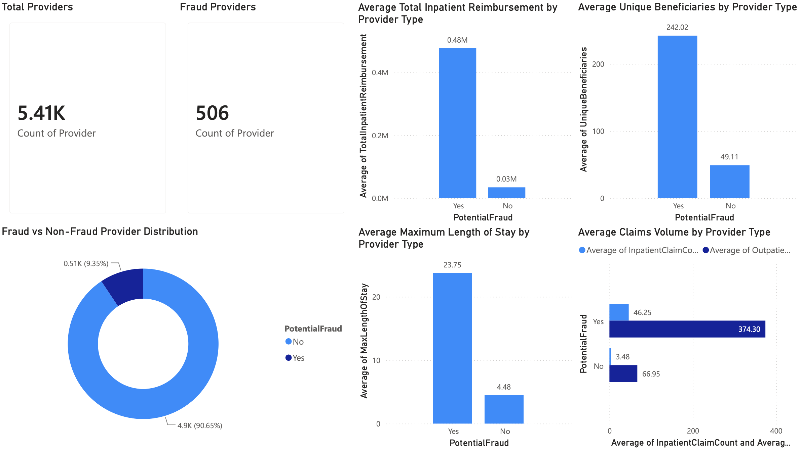
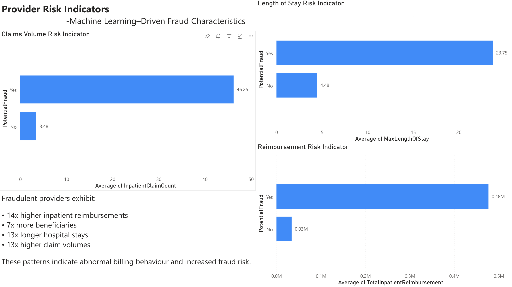

# Healthcare Claims Fraud Detection Using Machine Learning

## Project Overview

Healthcare fraud results in billions of dollars in financial losses annually, making fraud detection a critical challenge for healthcare organizations and insurance providers.

This project develops an end-to-end healthcare fraud detection solution using provider-level Medicare claims data. The project combines data engineering, exploratory data analysis (EDA), machine learning, SQL analytics, and Power BI reporting to identify potentially fraudulent healthcare providers.

The solution analyzes provider reimbursement behavior, claim activity, beneficiary utilization patterns, and healthcare service characteristics to detect fraud-related anomalies and support data-driven fraud investigations.

---

## Resume Highlights

* Built an end-to-end healthcare fraud detection pipeline using Medicare claims data.
* Engineered 17 provider-level fraud indicators from healthcare claims and beneficiary datasets.
* Developed machine learning models achieving 96.99% ROC-AUC and 91.09% Recall.
* Performed provider risk analysis using SQL and Python.
* Designed interactive Power BI dashboards for fraud monitoring and investigation.
* Generated actionable business recommendations to support healthcare fraud prevention.

---

## Business Problem

Healthcare organizations process millions of claims annually, making manual fraud investigation costly and inefficient.

Fraudulent healthcare providers may engage in:

* Excessive claim submissions
* Inflated reimbursement requests
* Unnecessary procedures
* Abnormal patient utilization
* Billing manipulation

The objectives of this project are to:

* Identify potentially fraudulent healthcare providers.
* Analyze provider-level fraud patterns.
* Build predictive fraud detection models.
* Generate actionable business insights.
* Support healthcare fraud investigation efforts.

---

## Technology Stack

### Programming & Analytics

* Python
* SQL
* Pandas
* NumPy

### Data Visualization

* Matplotlib
* Seaborn
* Plotly
* Power BI

### Machine Learning

* Scikit-Learn
* SMOTE

### Model Persistence

* Joblib

---

## Project Architecture

```bash
Raw Claims Data
        ↓
Data Understanding
        ↓
Feature Engineering
        ↓
Exploratory Data Analysis
        ↓
Data Preprocessing
        ↓
Fraud Detection Modeling
        ↓
Business Insights & Recommendations
        ↓
Power BI Dashboard
```

---

## Dataset

The project uses healthcare provider claims data containing:

* Beneficiary Data
* Inpatient Claims
* Outpatient Claims
* Provider Fraud Labels

### Final Modeling Dataset

* 5,410 Healthcare Providers
* 17 Engineered Features
* Binary Fraud Classification Target

### Target Distribution

| Class     | Providers |
| --------- | --------: |
| Non-Fraud |     4,904 |
| Fraud     |       506 |

**Fraud Rate:** 9.35%

---

## Project Workflow

### Notebook 01 - Data Understanding

* Dataset exploration
* Data quality assessment
* Variable inspection
* Initial observations

### Notebook 02 - Feature Engineering

* Provider-level aggregation
* Beneficiary feature creation
* Claims feature engineering
* Fraud modeling dataset creation

### Notebook 03 - Provider-Level EDA

* Fraud distribution analysis
* Reimbursement comparisons
* Beneficiary utilization analysis
* Length-of-stay analysis
* Correlation analysis

### Notebook 04 - Data Preprocessing for Machine Learning

* Feature selection
* Train-test split
* Standardization
* SMOTE implementation
* Modeling dataset creation

### Notebook 05 - Fraud Detection Modeling

* Logistic Regression
* Random Forest Classifier
* Model evaluation
* Feature importance analysis
* Model comparison

### Notebook 06 - Model Insights & Recommendations

* Fraud risk indicators
* Business insights
* Executive recommendations
* Operational impact analysis

---

## SQL Analysis

The project includes SQL-based healthcare provider analytics.

### 01_fraud_distribution.sql

* Fraud provider counts
* Fraud rate calculations
* Provider distribution metrics

### 02_reimbursement_analysis.sql

* Reimbursement comparisons
* High-cost provider analysis
* Financial anomaly detection

### 03_provider_analysis.sql

* Claim volume analysis
* Beneficiary utilization analysis
* Length-of-stay metrics
* Provider risk indicators

---

## Machine Learning Results

### Model Performance Comparison

| Metric    | Logistic Regression | Random Forest |
| --------- | ------------------: | ------------: |
| Accuracy  |              90.57% |        92.33% |
| Precision |              49.73% |        56.08% |
| Recall    |          **91.09%** |        82.18% |
| F1 Score  |              64.34% |        66.67% |
| ROC-AUC   |          **96.99%** |        96.12% |

### Selected Model

**Logistic Regression**

Selected because it achieved:

* Highest Recall
* Highest ROC-AUC
* Strong fraud detection capability
* Excellent class separation performance

In healthcare fraud detection, Recall is prioritized because missing fraudulent providers can result in significant financial losses.

---

## Saved Model

The final trained fraud detection model is stored as:

```bash
models/best_fraud_model.pkl
```

The model can be loaded using Joblib for future predictions and deployment.

---

## Key Fraud Indicators

The strongest predictors of fraud were:

1. MaxLengthOfStay
2. InpatientClaimCount
3. TotalInpatientReimbursement
4. UniqueInpatientBeneficiaries
5. TotalOutpatientReimbursement

These indicators consistently appeared during exploratory analysis and machine learning modeling.

---

## Business Insights

### Fraudulent Providers Generate Higher Reimbursements

| Metric                             |    Fraud | Non-Fraud |
| ---------------------------------- | -------: | --------: |
| Avg Total Inpatient Reimbursement  | $476,855 |   $34,056 |
| Avg Total Outpatient Reimbursement | $107,495 |   $19,138 |

Fraudulent providers receive substantially larger reimbursements than non-fraudulent providers.

---

### Fraudulent Providers Serve More Beneficiaries

| Metric                   | Fraud | Non-Fraud |
| ------------------------ | ----: | --------: |
| Avg Unique Beneficiaries |   242 |        49 |

Fraudulent providers demonstrate unusually high provider utilization.

---

### Fraudulent Providers Exhibit Longer Hospital Stays

| Metric             |      Fraud | Non-Fraud |
| ------------------ | ---------: | --------: |
| Avg Length of Stay |  5.32 Days | 1.87 Days |
| Max Length of Stay | 23.75 Days | 4.48 Days |

Length-of-stay metrics emerged as the strongest fraud indicators.

---

## Power BI Dashboard

An interactive Power BI dashboard was developed to support healthcare fraud monitoring and investigation.

### Dashboard Pages

#### Executive Overview

Provides:

* Total Providers
* Fraud Providers
* Fraud Distribution
* Reimbursement Analysis
* Beneficiary Analysis
* Claims Volume Analysis
* Length of Stay Analysis

#### Provider Risk Indicators

Provides:

* Reimbursement Risk Indicators
* Claims Volume Risk Indicators
* Length-of-Stay Risk Indicators
* Fraud Characteristics Summary

---

## Dashboard Screenshots

### Executive Overview



### Provider Risk Indicators



---

## Project Structure

```bash
healthcare-claims-fraud-detection/

├── dashboard/
│   └── healthcare_fraud_dashboard.pbix
│
├── data/
│   ├── raw/
│   ├── processed/
│   └── modeling/
│
├── models/
│   └── best_fraud_model.pkl
│
├── notebooks/
│   ├── 01_data_understanding.ipynb
│   ├── 02_feature_engineering.ipynb
│   ├── 03_provider_level_eda.ipynb
│   ├── 04_data_preprocessing_for_ml.ipynb
│   ├── 05_fraud_detection_modeling.ipynb
│   └── 06_model_insights_and_recommendations.ipynb
│
├── reports/
│   ├── executive_overview.png
│   ├── provider_risk_indicators.png
│   └── project_report.md
│
├── sql/
│   ├── 01_fraud_distribution.sql
│   ├── 02_reimbursement_analysis.sql
│   └── 03_provider_analysis.sql
│
├── README.md
├── requirements.txt
└── venv/
```

---

## Business Impact

This solution demonstrates how machine learning and healthcare analytics can be used to:

* Detect suspicious provider behavior.
* Reduce fraud-related financial losses.
* Improve audit efficiency.
* Prioritize high-risk providers.
* Support data-driven fraud prevention strategies.

---

## Future Improvements

Potential enhancements include:

* XGBoost implementation
* Fraud risk scoring framework
* Real-time fraud monitoring dashboard
* Streamlit deployment
* Automated fraud alert generation
* Advanced anomaly detection techniques

---

## Author

**Aadityaa Dava**

Data Analytics | Business Intelligence | Machine Learning
